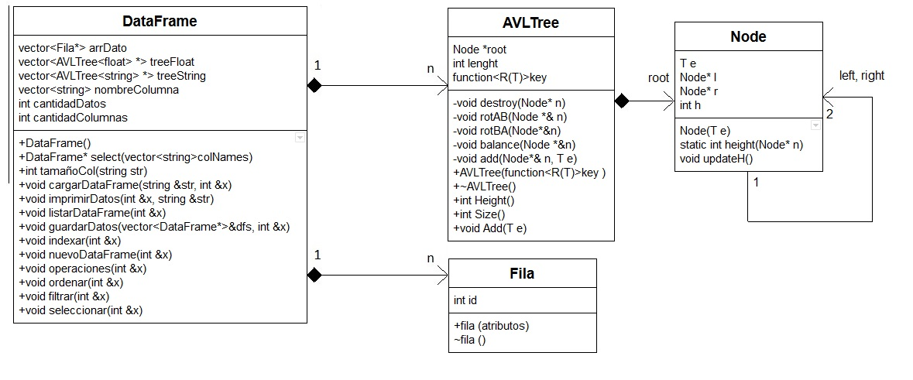

Informe Algoritmo y estructura de datos
=
Trabajo Final
-
### Integrantes
* Alexander Moisés Meléndez Ríos
### Introducción
A lo largo del tiempo, el ser humano ha ido desarrollando diversas técnicas de programación para poder simplificar el proceso de almacenamiento y uso de datos. Tal proceso, permite a las personas el manejo rápido de información y el rápido acceso a ellas de manera muy sencilla. Es así, este trabajo está enfocado en realizar una biblioteca en c++ donde se pueda guardar gran cantidad de información y que realice funciones como  ordenamiento o filtrado de datos. Para ello, se harán uso de dataframes para una visualización de datos concisas ya que la información se irá almacenando en filas y columnas, donde el usuario pueda intereactuar fácilmente con ella. De esta manera, con la realización de este trabajo se espera promover nuestro pensamiento innovador al resolver una problemática y tener una visión más amplia del manejo de datos.       
### Problema 
Crear una biblioteca en c++ que permita el almacenamiento de millones de datos y cumpla funciones como:
*	Importación de datos
*	Indexado de datos por columnas
*	Selección de datos por columnas
*	Filtrado de datos por columnas
*	Ordenamiento de datos por columnas
*	Exportación de datos a archivos planos con diferente formato
### Objetivos
* Objetivo general: Resolver el problema mediante el uso de dataframe y métodos de ordenamiento y búsqueda binaria
* Objetivo específico:
  **Aplicar** los conocimientos desarrollados en clase para la realización de códigos adaptados a una nueva                                   problemática.
  **Evaluar** los distintos tipos de métodos de ordenamiento y determinar el más óptimo para el desarrollo del proyecto.
  **Crear** un nuevo software donde se almacene, guarde y clasifique distintos tipos de dato.
### Marco conceptual
* Dataframe: Es una estructura que contiene datos tabulares y los almacena mediante filas (rows) y columnas (columns). La forma de un Dataframe es comparable a la de una tabla de Excel, pero los datos contenidos suelen estar indexados. Además, según Balagueró (2018), “cada fila corresponde a un objeto de la muestra y cada columna a una variable”.

* Métodos de ordenamiento: Dentro de la informática, como su mismo nombre lo dice es una forma de ordenar cierto tipo de datos o estructuras de datos, generalmente están basados en algoritmos que sean eficientes a la hora de implementarlos.  Dentro de los algoritmos más conocidos se encuentran Quicksort y Heapsort.

* Métodos de búsqueda: Al igual que los métodos de ordenamiento, las búsquedas son descritas por su mismo nombre, están basadas en algoritmos y existen muchos tipos como la búsqueda secuencial, la cual consiste en encontrar un dato u objeto recorriendo cada elemento hasta encontrarlo. Por otra parte, para realizar la tarea en un tiempo mucho menor se crearon métodos más eficientes como el Binary Search el cual está basado en el lema “divide y vencerás” y tiene una longitud de tiempo logarítmica.

* Diagrama de árboles: Según Ferris y Albert (2019), un árbol o diagrama de árbol “[…] es una colección de elementos llamados nodos, uno de los cuales se distingue como raíz, junto con una relación que impone una estructura jerárquica entre los nodos”. Este diagrama tiene aplicaciones en la estadística, negocios, informática y otros.

### Diagrama de clases (entidades)

### [Elaborar plan de trabajo detallado](https://github.com/xanderMMR/PROYECTO-FINAL-ALGORITMOS/milestones)
### Cronograma
### Referencias
* Balagueró, A. (2018). ¿Qué son los datasets y los dataframes en el Big Data?. Recuperado de https://www.deustoformacion.com/blog/programacion-diseno-web/que-son-datasets-dataframes-big-data
* Ferris, R. & Albert, J. (2019). Árboles. Recuperado de http://informatica.uv.es/iiguia/AED/oldwww/2001_02/Teoria/Tema_14.pdf

# Nota 12
